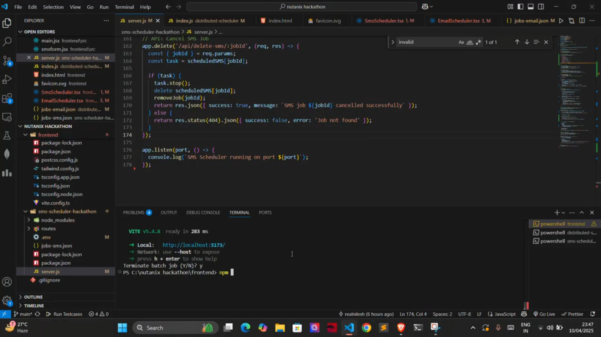

#[](https://drive.google.com/file/d/1e3Tkt68NZbyvbfjCPYgJtJ4sLhsvrLr_/view?usp=sharing)


# Email & SMS Notification Scheduler

A lightweight Node.js service that sends scheduled emails and SMS messages using Node‑Cron, Twilio, and Nodemailer. Exposes an Express API for on‑demand testing and uses environment variables for configuration.

---

## 🔧 Prerequisites

* **Node.js** v14+ and **npm**
* A Twilio account (Account SID, Auth Token, and a Twilio phone number)
* A valid SMTP email account (e.g., Gmail) for Nodemailer

---

## 🚀 Backend Install & Setup

1. **Clone the repository**

   ```bash
   git clone https://github.com/ZORDxDD/nutanix_scheduler.git
   cd nutanix_scheduler
   ```

2. **Install dependencies**

   ```bash
   npm install
   ```

3. **Create a `.env` file** in the project root with the following variables:

   ```dotenv
   TWILIO_ACCOUNT_SID=your_twilio_account_sid
   TWILIO_AUTH_TOKEN=your_twilio_auth_token
   TWILIO_PHONE_NUMBER=+1234567890    # your Twilio-issued phone number

   EMAIL_SERVICE=gmail                 # or your SMTP provider, e.g. 'hotmail'
   EMAIL_USER=your_email@example.com
   EMAIL_PASS=your_email_password

   CRON_SCHEDULE=*/30 * * * *          # default: every 30 minutes

   SMS_DEFAULT_TO=+19876543210         # fallback phone number for scheduled SMS
   EMAIL_DEFAULT_TO=recipient@example.com
   PORT=3000                           # optional: change server port
   ```

4. **Start the scheduler service**

   ```bash
   npm run dev
   ```

   > This runs `node index.js` (configured in `package.json`) and reloads on file changes if you have a watcher like nodemon.

---

## 📡 Backend API Endpoints

* **GET** `/test-sms?to=<PHONE_NUMBER>`
  Sends an immediate SMS to the specified phone number.

* **GET** `/test-email?to=<EMAIL_ADDRESS>`
  Sends an immediate email to the specified email address.

**Examples:**

```bash
curl "http://localhost:3000/test-sms?to=+919812345678"
curl "http://localhost:3000/test-email?to=user@example.com"
```

---

## 🌐 Frontend Integration

If you have the frontend in a separate repo, follow these steps:

1. **Clone or link the frontend project**

   ```bash
   git clone https://github.com/ZORDxDD/nutanix_frontend.git
   cd nutanix_frontend
   ```

2. **Install frontend dependencies**

   ```bash
   npm install
   ```

3. **Configure API base URL**
   In `src/config.js`, set:

   ```js
   export const API_BASE_URL = 'http://localhost:3000';
   ```

4. **Run the frontend**

   ```bash
   npm start
   ```

   Opens the UI at `http://localhost:4000` (default).

5. **Use the UI**

   * Click **"Send Test SMS"** or **"Send Test Email"** to trigger messages via the backend.
   * View scheduler status and last sent timestamps.

---

## 🛠️ Customization

* **Change backend port**: set `PORT` in `.env`, and update `API_BASE_URL` accordingly.
* **Add more schedules**: duplicate and modify the `cron.schedule(...)` blocks in `index.js`.
* **Customize messages**: edit the `smsBody` and `mailOptions` objects in `index.js` for custom content.

---
